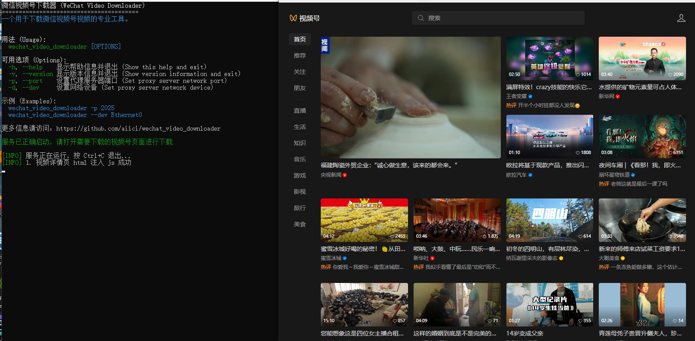
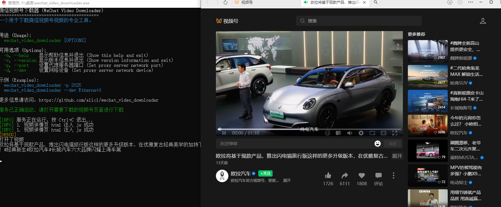
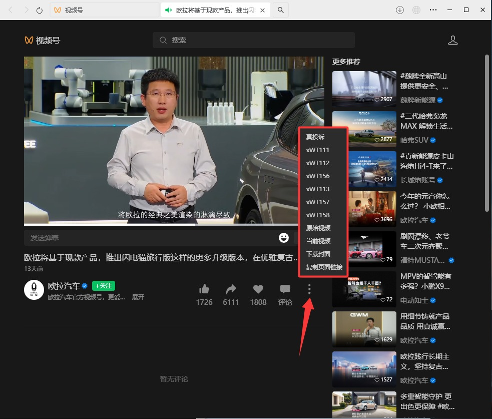

# 微信视频号下载器 (WeChat Video Downloader)

[](./LICENSE)
[](https://golang.org/)
[](https://github.com/aiici/wechat_video_downloader/releases)
[](https://github.com/aiici/wechat_video_downloader/issues)
[](https://github.com/aiici/wechat_video_downloader)

一个用于下载微信视频号视频的专业工具，支持 Windows 系统，基于代理技术实现网页端视频号内容的解析与下载。

## 功能特性

- 微信视频号视频下载
- 自动注入脚本，简化操作流程
- 支持多种视频格式与封面下载
- 证书自动安装与系统代理自动配置
- 命令行参数灵活配置

## 安装与运行

1. **下载 Release 包**  
   前往 [Releases](https://github.com/aiici/wechat_video_downloader/releases) 下载对应平台的可执行文件。

2. **运行程序**  
   在命令行中进入程序目录，执行：

   ```bash
   # Windows
   wechat_video_downloader.exe
   ```
  
3. **首次运行需安装证书**  
   证书会自动安装，若失败按照程序提示，在浏览器中访问 [http://127.0.0.1:2025](http://127.0.0.1:2025) ，根据说明安装证书。

## 命令行参数

| 参数              | 说明                                 |
|-------------------|--------------------------------------|
| `-h, --help`      | 显示帮助信息并退出                   |
| `-v, --version`   | 显示版本信息并退出                   |
| `-p, --port`      | 设置代理服务器端口（默认2025）       |
| `-d, --dev`       | 设置网络设备          |

## 使用示例

- 指定端口运行：

  ```bash
  wechat_video_downloader.exe -p 2025
  ```
  
## 图文教程

### 打开程序后自动安装证书，然后等待运行成功后，打开视频号



### 2. 点击目标下载视频



### 3. 视频下载，提供了多种选项



## 依赖

- [SunnyNet](https://github.com/qtgolang/SunnyNet)
- [fatih/color](https://github.com/fatih/color)
- 其他依赖详见 [go.mod](./go.mod)

## 贡献

欢迎提交 issue 或 pull request 参与项目改进！

## 开源协议

本项目基于 MIT 协议开源，详见 [LICENSE](./LICENSE)。

更多信息请访问：[https://github.com/aiici/wechat_video_downloader](https://github.com/aiici/wechat_video_downloader)
